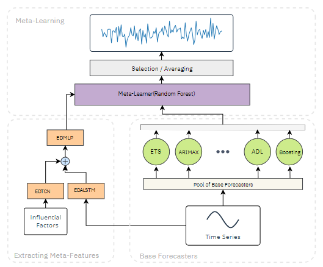

# The source code of the paper : "Retail time series forecasting using an automated deep meta-learning framework"


Use the package manager pip to install dependencies:

```bash
pip install -r requirements.txt
```
---


The code used wandb for the hyper-parameter optimization. You can connect to your account by:

```bash
wandb login
```
---

You can run the optimization by:

```bash
python src/experiment.py
```
---

The directories `fforma` and `M0` contain the source code of the benchmark models.

The base-forecasters' code, in R, can be found from [this repository](https://github.com/Shawn-nau/retail-sales-forecasting-with-meta-learning), and forecasts for 1, 4, and 7 steps are in the directory `base-forecasters`.

---

The results of the parameters that had the lowest validation error are saved in the directory `results_final`, and `results_final\analysis.ipynb` shows the RMSEs, AvgRelRMSEs, and AvgRelMAEs of the paper.

---

The IRI dataset is in the directory `src\dataset`.